# 🚆 Railway Management & Train Booking System (C++)

A modular, console-based **Railway Management System** built in **C++** using
robust **Object-Oriented Programming (OOP)** principles.

The system not only handles **ticket booking and cancellation**, but also
**manages trains, routes, fares, users, and authentication**, simulating how
a real-world railway reservation and management backend operates.

This project emphasizes **clean architecture, scalability, and system design**.

---

## Core Capabilities

## Passenger Operations

- Passenger authentication and secure login
- Source → destination based ticket booking
- Ticket generation using **HTML, CSS, and JavaScript**
- Date-wise seat allocation
- Waiting list management
- Ticket cancellation
- Automatic fare calculation with detailed breakdown

## Admin & System Management

- Admin authentication with role-based access
- Train management
- Route and station management
- Coach management
- Configurable fare rules including:
  - Coach-wise rate per kilometer
  - GST percentage
  - Reservation charge
  - Superfast charge
  - Tatkal charge
  - Discount percentage
- Staff management
- System reports and analytics
- Data storage using files

---

## System Architecture

The project follows a **layered and modular architecture**, similar to
real backend systems:

- **UI Layer**  
  Handles user interaction and menus

- **Domain Layer**  
  Core entities such as Train, Route, Ticket, User, and Fare

- **Core Layer**  
  Business logic including booking flow, seat allocation, cancellation,
  and fare computation

- **Infrastructure Layer**  
  File handling and persistent data storage

- **Authentication Module**  
  Role-based access control for Admin and Passenger

This separation ensures the system is **maintainable, extensible, and testable**.

---

## Technologies & Concepts Used

- Language: **C++**
- Object-Oriented Programming
- STL containers and Algorithms
- File Handling

---

## Project Structure
```text
TRAIN-BOOKING-SYSTEM/
│
├── data/
│   ├── Images/
│   ├── fare_config.txt
│   ├── passengers_auth.txt
│   ├── staff.txt
│   ├── stations.txt
│   ├── tickets.txt
│   ├── trains.txt
│   └── users.txt
│
├── include/
│   ├── Authentication/
│   │   ├── Admin_auth.h
│   │   ├── PassengerAuth.h
│   │   └── PasswordUtil.h
│   │
│   ├── core/
│   │   └── BookingSystem.h
│   │
│   ├── domain/
│   │   ├── Coach.h
│   │   ├── FareCalculator.h
│   │   ├── FareConfig.h
│   │   ├── FareContext.h
│   │   ├── FareResult.h
│   │   ├── Passenger.h
│   │   ├── Seat.h
│   │   ├── Station.h
│   │   ├── Ticket.h
│   │   ├── Train.h
│   │   └── User.h
│   │
│   ├── infra/
│   │   └── Storage.h
│   │
│   └── ui/
│       ├── AdminConsole.h
│       ├── ConsoleStyle.h
│       ├── EntryConsole.h
│       ├── GuestConsole.h
│       ├── InputHelper.h
│       ├── PassengerConsole.h
│       └── PassengerPortal.h
│
├── src/
│   ├── Authentication/
│   │   ├── Admin_auth.cpp
│   │   ├── PassengerAuth.cpp
│   │   └── PasswordUtil.cpp
│   │
│   ├── core/
│   │   └── BookingSystem.cpp
│   │
│   ├── domain/
│   │   ├── Coach.cpp
│   │   ├── FareCalculator.cpp
│   │   ├── Passenger.cpp
│   │   ├── Seat.cpp
│   │   ├── Station.cpp
│   │   ├── Ticket.cpp
│   │   ├── Train.cpp
│   │   └── User.cpp
│   │
│   ├── infra/
│   │   └── Storage.cpp
│   │
│   └── ui/
│       ├── Admin_helpers.cpp
│       ├── AdminConsole.cpp
│       ├── ConsoleStyle.cpp
│       ├── EntryConsole.cpp
│       ├── GuestConsole.cpp
│       ├── InputHelper.cpp
│       ├── PassengerConsole.cpp
│       └── PassengerPortal.cpp
│
├── main.cpp
├── train.exe
├── .gitignore
└── README.md
```

---

## Train System Workflow

### System Welcome Screen

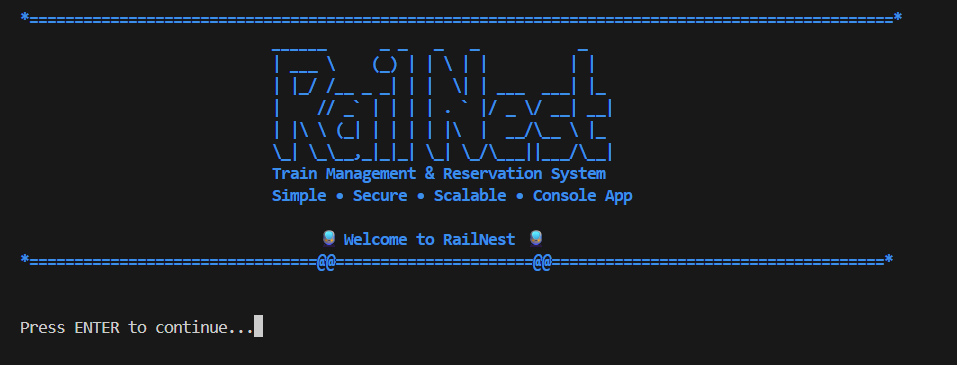

This welcome screen appears when the application starts and introduces **RailNest – a Train Management and Reservation System** built as a console-based application.  
It displays the system banner and waits for the user to press **ENTER** before proceeding to the main menu.

---

### Main Menu

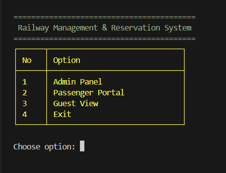

The main menu acts as the central navigation hub of the system, allowing users to access different modules such as the Admin Panel, Passenger Portal, and Guest View.  
It enables users to select an option to perform administrative tasks, book tickets, explore train information, or exit the application.

---

### Admin Authentication

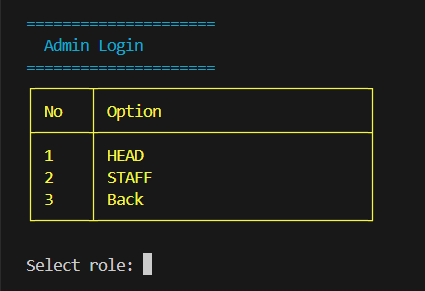

This screen allows administrators to select their role before accessing the admin panel, such as Head or Staff.  
It helps the system organize administrative responsibilities and control access to management features.

---

### Admin Control Panels

<table>
<tr>
<td align="center">

**Head Admin Panel**

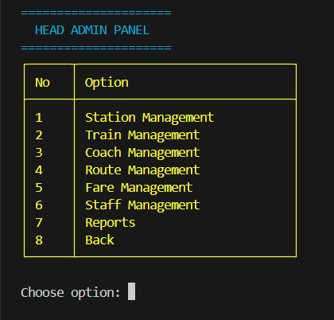

</td>
<td align="center">

**Staff Admin Panel**

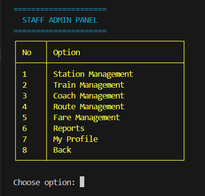

</td>
</tr>
</table>

The **Head Admin Panel** provides full administrative control including staff management and system-level configuration.  
The **Staff Admin Panel** allows operational management such as handling stations, trains, routes, and fare details.  
The key difference is that **Head Admin has higher privileges**, while Staff members have limited operational access.

---

### Administrative Management Modules

<table>
<tr>
<td align="center">
<b>Station Management</b><br>
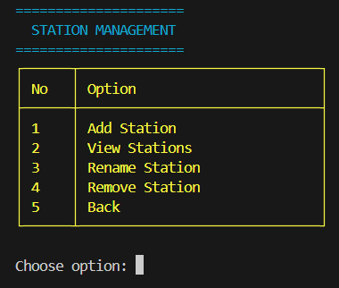
</td>

<td align="center">
<b>Train Management</b><br>
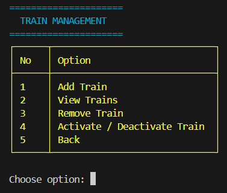
</td>

<td align="center">
<b>Coach Management</b><br>
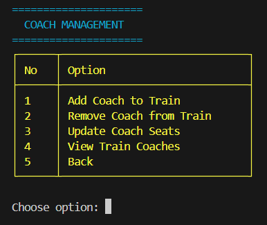
</td>

<td align="center">
<b>Route Management</b><br>
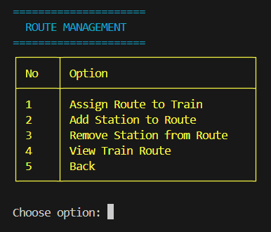
</td>
</tr>

<tr>
<td align="center">
<b>Fare Management</b><br>
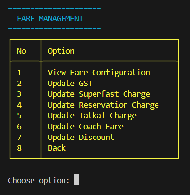
</td>

<td align="center">
<b>Staff Management</b><br>
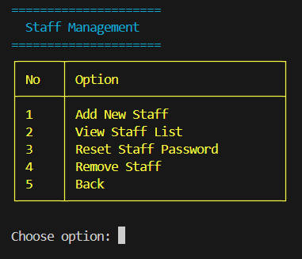
</td>

<td align="center">
<b>Reports Panel</b><br>
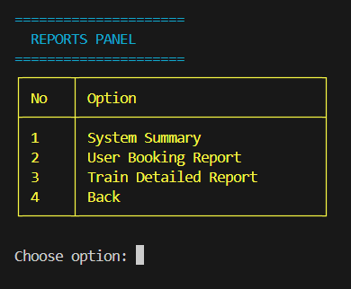
</td>

<td align="center">
<b>Staff Profile</b><br>
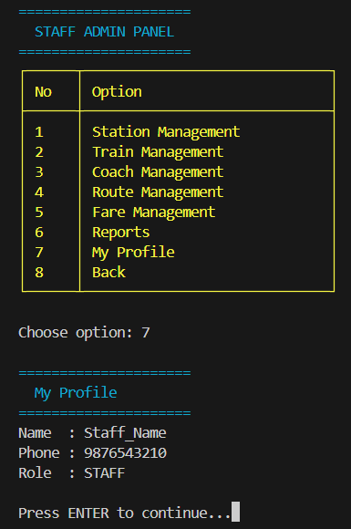
</td>
</tr>
</table>

The administrative modules allow system managers to control all core railway operations including stations, trains, coaches, routes, and fare configuration.  
These panels provide structured tools for managing staff accounts, generating operational reports, and maintaining system data efficiently.

---

### Passenger Authentication

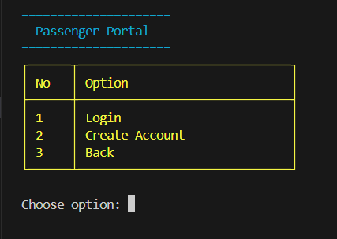

This screen allows passengers to access the Passenger Portal where they can log in to their existing account or create a new account.  
It ensures that only authenticated users can proceed to booking tickets and managing their reservations.

---

### Passenger Console

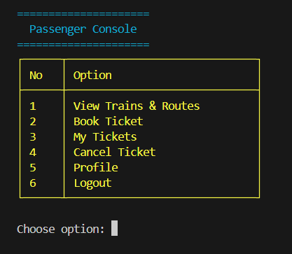

After successful authentication, passengers access the Passenger Console which provides options to interact with the reservation system.  
From this console, users can view trains and routes, book tickets, check their bookings, cancel tickets, manage their profile, or logout.

---

### Ticket Generation

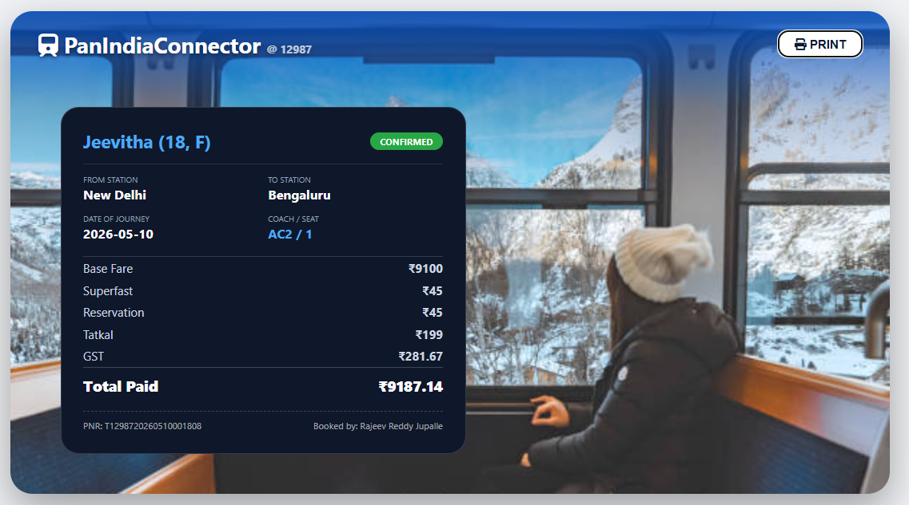

After a successful booking, the system generates a detailed ticket containing passenger information, journey details, seat allocation, and fare breakdown.  
The ticket displays the PNR number and total amount paid, allowing passengers to verify their reservation and print the ticket if needed.

---

### Guest Console

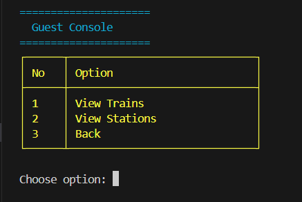

The Guest Console allows users to explore basic system information without creating an account.  
Guests can view available trains and stations, helping them check routes and services before registering or booking tickets.

---

### System Sign Off

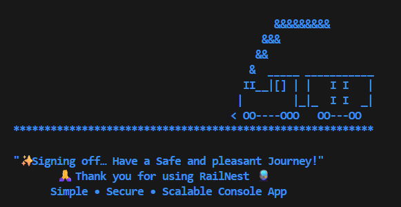

This screen is displayed when the user exits the application, indicating that the session has ended successfully.  
It thanks the user for using RailNest and provides a friendly closing message before the program terminates.

---

## Program Execution

1. **Clone the repository**

```bash
git clone https://github.com/Rajeevreddy-2006/Train-Booking-System.git
```

2. **Open the terminal**

  This project uses formatted console output, so running it in a **large or full-screen terminal window** is recommended for the best interface experience.

3. **Compile the program**

```bash
g++ -I include main.cpp src/domain/*.cpp src/core/*.cpp src/infra/*.cpp src/ui/*.cpp src/Authentication/*.cpp -o train.exe
```

4. **Run the application**

```bash
./train.exe
```

5. **The Railway Management & Train Booking System will now start and display the welcome screen.**

---

# Resources

The following resources were used for improving the console interface and visual styling of the project.

- **ASCII Art for Title**  
  https://patorjk.com

- **ANSI Escape Sequences (Console Styling Reference)**  
  https://gist.github.com/fnky/458719343aabd01cfb17a3a4f7296797

- **ASCII Art for Train Illustration**  
  https://www.asciiart.eu

---

## 🔗 Project Repository

GitHub Repository: https://github.com/Rajeevreddy-2006/Train-Booking-System

---
